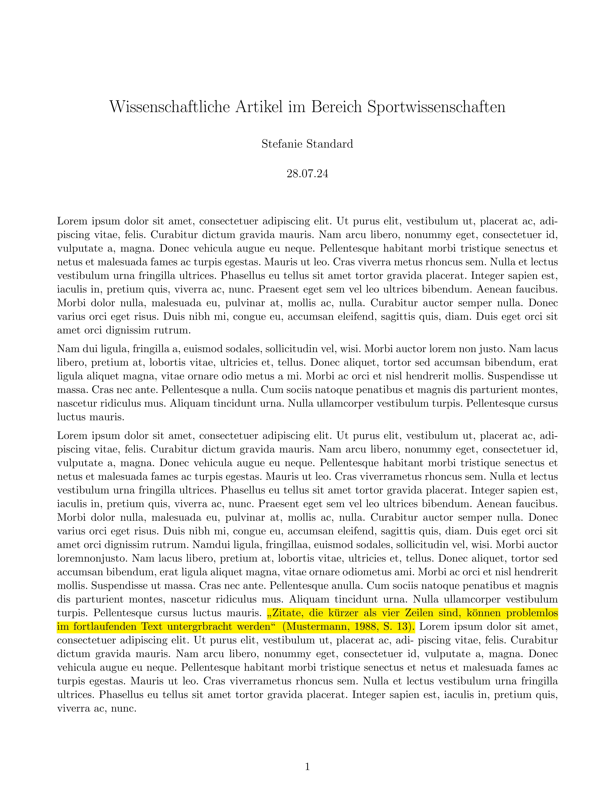
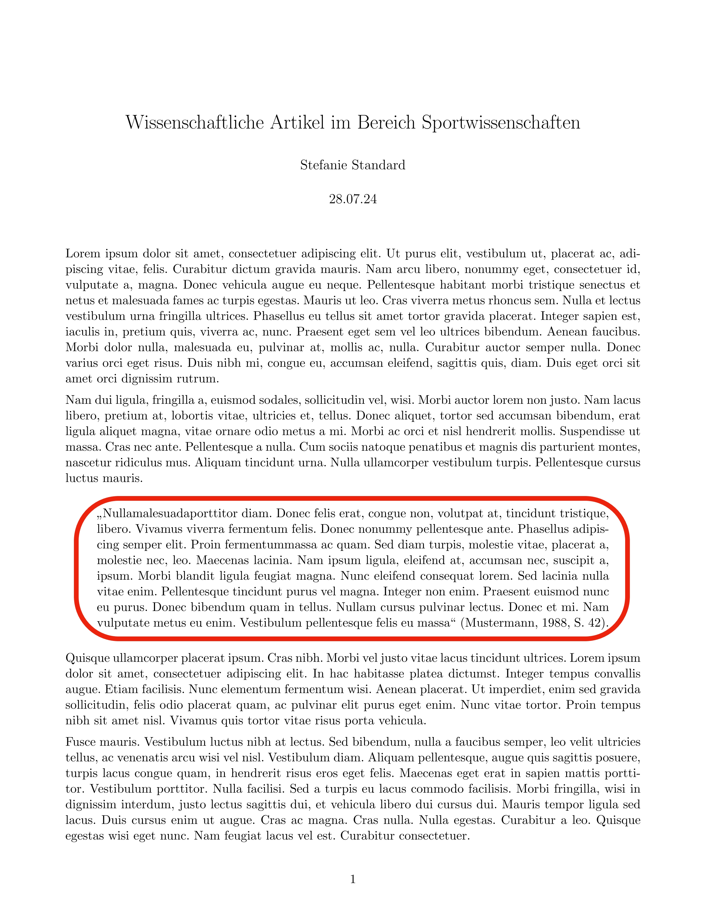

<!--
author: Tim Heemsoth
email: tim.heemsoth@uni-flensburg
version: 0.0.1
language: de
narrator: Deutsch Female

import:  https://raw.githubusercontent.com/EUF-SpoWis/Wissenschaftliches-Arbeiten/refs/heads/main/config.md

import: https://raw.githubusercontent.com/LiaTemplates/citations/refs/heads/main/README.md

@onload
window.citationStyle = "apa"
window.bibliographyLoad("https://raw.githubusercontent.com/Just-Jannis/Barrierefreie-Lernmaterialien/refs/heads/main/BarrierefreiLit.bib")
@end
-->

# Richtig wissenschaftlich zitieren

| Parameter                | Kursinformationen                                                                               |
| ------------------------ | ----------------------------------------------------------------------------------------------- |
| **Veranstaltung:**       | @config.lecture                                                                                 |
| **Semester:**            | @config.semester                                                                                |
| **Hochschule:**          | `Europa-Universität Flensburg`                                                                  |
| **Inhalte:**             | `Motivation der Vorlesung und Beschreibung der Organisation der Veranstaltung`                  |
| **Link auf GitHub:**     | https://github.com/Just-Jannis/Barrierefreie-Lernmaterialien/blob/main/barrierefreieMaterialien.md    |
| **Autoren:**             | @author                                                                                         |

> (c) Alle Rechte vorbehalten. 

Wissenschaftliches Arbeiten bedeutet nicht nur, eigene Gedanken verständlich darzustellen. Ebenso wichtig ist es, die Ideen, Erkenntnisse und Formulierungen anderer Personen eindeutig zu kennzeichnen. Wer Quellen korrekt angibt, macht nachvollziehbar, worauf die eigenen Aussagen beruhen, und ermöglicht es den Leser:innen, die verwendete Literatur selbst zu überprüfen.

Richtiges Zitieren erfüllt dabei mehrere wichtige Funktionen: Es schützt vor Plagiaten, würdigt die Arbeit anderer Autor und erhöht die Glaubwürdigkeit der eigenen wissenschaftlichen Arbeit. Gleichzeitig kann das Zitieren zunächst kompliziert wirken. Wann muss eine Quelle angegeben werden? Was ist der Unterschied zwischen einem direkten und einem indirekten Zitat? Wie werden Bücher, Zeitschriftenartikel oder Internetquellen im Literaturverzeichnis aufgeführt?

In diesem Kurs lernst du die grundlegenden Regeln des Zitierens nach den Richtlinien der American Psychological Association, kurz APA, kennen. Du erfährst, wie Quellen im Text angegeben werden, wie ein Literaturverzeichnis aufgebaut ist und welche Besonderheiten bei unterschiedlichen Quellenarten beachtet werden müssen. Anhand von Beispielen und Übungen kannst du das Gelernte direkt anwenden und typische Fehler erkennen.

Ziel des Kurses ist es, dir mehr Sicherheit beim wissenschaftlichen Schreiben zu geben. Am Ende sollst du Quellen selbstständig korrekt in deine Texte einbinden und ein vollständiges Literaturverzeichnis nach APA erstellen können.

## Im Fließtext richtig zitieren
Beim Schreiben einer wissenschaftlichen Arbeit ist es essentiell neben den Eigenen Erkenntnissen und Ergebnissen auch bereits vorhandene Resultate aufzuzeigen, zu erwähnen oder zu diskutieren. Die Verwendung fremder wissenschaftlicher Quellen ist dabei nicht nur erlaubt sonder auch erwünscht und in den meisten Fällen unerlässlich. Jedoch müssen derartige Stellen im Text, in denen du fremde Ergebnisse, Meinungen, Fomruliereungen, etc. verwendest, **immer** gekennzeichnet werden. Machst du nicht deutlich, dass du gerade andere Quellen verwendest, wird dies als Plagiat bzw. Täuschungsversuch gewertet. Du kannst also durch fehlerhaftes zitieren im Fließtext leicht in Schwierigkeiten geraten. Jedoch ist die richtige Angabe eines Zitates im Text kein Hexenwerk, weshalb man sich den ganzen soeben angesprochenen Ärger leicht ersparen kann.

Im Fließtext wird zwischen zwei Arten von Zitaten unterschieden: den sogenannten direkten Zitaten und den indirekten Zitaten. Was darunter zu verstehen ist schauen wir uns in den beiden folgenden Abschnitten genauer an.

### Direkte Zitate
Bei direkten Zitaten handelt es sich um wortgenaue übernahmen aus anderen Texten bzw. Quellen. Solche Zitate werden Grundsätzlich in "doppelte Anführungszeichen" gesetzt. Dabei werden kurze Zitate (bis zu 4 Zeilen) einfach im fortlaufenden text aufgeführt. Längere Zitate werden im Blocksatz mittig eingerückt. Um zu kennzeichnen, welcher Quelle du das Zitat entnommen hast, musst du außerdem den Nachnamen des Autors, das Jahr, in dem die Qulle erschienen ist, und die Seitenzahl der entnommenen Passage angeben. Dies kann im im Fließtext beispielsweise folgendermaßen aussehen:

 

Es ist zu beachten, dass direkte Zitate stets buchstanben- und zeichengetreu übernommen werden müssen. Dies gilt auch für Rechtschreib- oder Zeichensetzungsfehler, die möglicherweise in der Originalquelle enthalten sind. Änderungen oder Ergänzungen der Originalquelle sind durch **[eckige Klammern]** zu kennzeichnen. Falls worte bzw. irrelevante Satzteile wie Nebensätze weggelassen werden, muss dies durch **[...]** gekennzeichnet werden. Falls du fremdsprachliche Quellen zitieren möchtest, gibst du das Zitat in der jeweiligen Fremdsprache an. Falls es sich bei dieser Sprache nicht um Englisch handelt sollte eine Übersetzung (z.B. als Fußnote) angegeben werden.

**Beispiele:**
* Ein Bewegungshabit ist nach Hartmann (2018, S. 107) „ein situationsüberdauernder Modus des Wahrnehmens und Sich-Bewegens in Auseinandersetzung mit einem Lerngegenstand.“

* „Im Ergebnis der bildungstheoretischen Reflexionen [...] wird Erziehender Sportunterricht hier als Ermöglichung von Bewegungsbildung im Horizont allgemeiner Bildung [TH: im Sinne Klafkis] verstanden“ (Prohl, 2017, S. 88).

Damit du überprüfen kannst, wie gut du bereits mit direkten Zitaten zurecht kommst, folgt ein kurzes Quiz, mit dem du dein Wissen testen kannst. 

### Indirekte Zitate

## Quellen im Literaturverzeichnis richtig angeben

